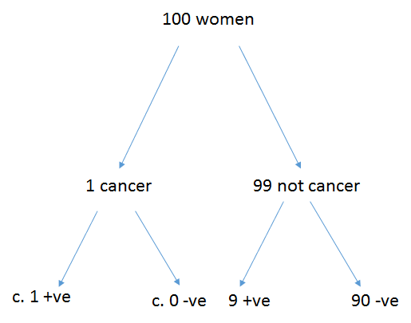

<!-- CP - update 05/08/2020 -->


# (PART) Probability and Distributions {-}

# Probability {#probability}

```{r echo=FALSE}
library(ggplot2)
```

## Introduction {#INTprob}

<span style="background-color: white"> *Probability: as a measurable quantity: the extent to which a particular event is likely to occur, or a particular situation be the case, as measured by the relative frequency of occurrence of events of the same kind in the whole course of experience, and expressed by a number between 0 and 1.*
<br/>Oxford English Dictionary [-@dictionary1989oxford]</span>

Here we define probability, consider how to represent it mathematically, present some axioms and basic results, and work through some example probability calculations. By the end of the this chapter, you should be able to   

1. distinguish the different definitions of probability
2. understand the basic axioms of probability.
3. understand Bayes' theorem and its simple applications 
 

In 2006, the polling organisation, Populus Limited, randomly sampled 1,509 adults, age 18 and older, by telephone between January 6$^{th}$ and 8$^{th}$ and asked each adult their voting intention (Labour, Conservative, Liberal Democrat, and Other).  The resulting percentages were:

<caption> (\#tab:Votint) Voting intention in Populus survey. </caption>

\begin{table}
\label{Votint}
\caption{Voting Intention in Populus survey}
\end{table}
  Party        | Percentage 
  -------------|--------------
  Labour         | 39 
Conservative     | 36
Liberal Democrat | 16 
Other            |  9 


How close are these sample __statistics__ to the population __parameters__? A different sample would have got a different answer , so there must be uncertainty associated with these sample statistics.

Sampled value =  Parameter + Chance Error 

i.e. signal + noise

The parameter(s) in this case are the unknown population proportions. 

* So what is the magnitude of the error?
* Ideas from probability will help with this.

Througout statistics, we consider the evaluation of hypotheses where we attach a probability to a particular event given a particular set of results.  This allows us to decide whether to accept or reject the hypotheses. Therefore, this chapter will consider the concept of probability in some detail. 

### Random phenomena and uncertain outcomes

Lots of processes present us with uncertainty - consider processes that are random, repeatable and uncertain.

__For example__

* Process: Toss a coin
  * Outcomes: Head, Tail, Side
* Process: A person who does not have HIV is tested for HIV
  * Outcomes: Negative test result, Positive test result (a false positive)
* Process: Departure time of a flight from Edinburgh to London on an airline. 
  * Outcomes: the flight departs on time, 1 minute late, 2 minutes late, etc

Probability is a branch of mathematics that deals with the quantification of uncertainty. 

A few things to remember about probabilities:

+ Probabilities must lie between 0 and 1 (and cannot be larger than one or less than zero)
+ Probabilities are sometimes expressed as percentages, e.g. 0 = 0%, 0.2 = 20%, 0.02 = 2%


## Sample spaces and events 

There are a lot of terms (explained below) related to the possible outcomes of a random process: 

+ sample space, 
+ elementary events, 
+ compound events, 
+ mutually exclusive events, 
+ independent events.

<br> 1. The collection of all possible outcomes of an experiment is the __sample space__, and is denoted $\mathcal{S}$ (or as in Figure \@ref(fig:Vennunion). $\Omega$). Examples of sample spaces:

+ Toss Coin: $\mathcal{S}$ = {H,T} (Note the use of curly brackets to indicate a set.). We will assume from here on, that the chance of a coin falling on its side is so negligible that it can be ignored.
+ HIV Test: $\mathcal{S}$ = {Negative, Positive}
+ Airplane actual departure time - scheduled departure time: $\mathcal{S}$ = {0 to 360 minutes} assuming the flight is cancelled after 3 hours.

<br> 2. A subset of outcomes in $\mathcal{S}$ is called an Event and it's often labelled by a capital letter, e.g. $A$.  

Let $A$ and $B$ be any two events defined on a particular sample space. 

For example The set of all possible outcomes occurring: $A$ alone, $B$ alone, or in either $A$ and $B$..

+ union of $A$ and $B$, $A \cup B$ or  $A ~\mbox{or}~ B$ (Figure \@ref(fig:Vennunion)).

```{r Vennunion, echo=FALSE, fig.cap="A Venn diagram of the union of events A and B", out.width = '100%'}
knitr::include_graphics("./figures/AunionB.jpg")
```
<!--<caption> (\#figure:Vennunion)</caption>
-->

+ The set of all events in $\mathcal{S}$ that do not occur in A is: complement of $A$ or $\overline{A}$ or $A^c$.

+ When $A$ and $B$ have no outcomes in common, they are mutually exclusive or disjoint, i.e., $A \cap B$ = $\emptyset$. $\emptyset$ means empty set. 

If there is just one outcome in an event A, the event is called simple or elementary, otherwise it is called compound.

When $A$ and $B$ have no outcomes in common, they are __mutually exclusive__ or __disjoint__, i.e., $A \cap B$ = $\emptyset$


The set of all outcomes occurring only in both $A$ and $B$ is 

+ intersection of $A$ and $B$, $A \cap B$, or  $A ~\mbox{and}~ B$ (Figure \@ref(fig:Vennintercept)).


```{r Vennintercept, echo=FALSE, fig.cap="A Venn diagram of the intercept of events A and B", out.width = '100%'}
knitr::include_graphics("./figures/AinterceptB.jpg")
```

<!-- -->

+ The set of all events in S that do not occur in $A$ is the __complement__ of $A$ or $\overline{A}$ or $A^c$. So if the probability of sighting the Loch Ness Monster in a day at Loch Ness is 0.3 (e.g. $Pr(Nessie)=0.3$) then the probability we don't see anything would be $Pr(\overline{Nessie})=1-0.3=0.7$. 
This is called the __law of complementary probability__.


**Example** Roll 2 dice and count the total number of dots face up. Define the two events $A$ and $B$ as follows:

  $A$ = get an even number
  $B$ = get a number that is divisible by 3

Thus $A$ = ({2}, {4}, {6}, {8}, {10}, {12}). and $B$ = ({3}, {6}, {9}, {12}). Then

 + $A \cup B$ = {2,3,4,6,8,9,10,12}
 +  $A \cap B$ = {6,12}
 + $A^c$ = {3,5,7,9,11}
 +  Are $A$ and $B$ disjoint? No. $A \cap B \ne \emptyset$.


This example contain _stochasticity_ - a particular realisation of the process isn't completely predictable. The usual way of treating this is probabilistically. 

## Definition of Probability and 3 Axioms

### Probability

Informally:  Consider a process, with multiple uncertain outcomes, that could be repeated infinitely often, in an identical and independent fashion, then the probability of an event $A$, $\Pr(A)$, is the long run relative frequency of $A$.

How does the above definition compare to probability in the following contexts?

* **Q4.1** The probability I win on a European roulette wheel choosing 1 number?
* **Q4.2** The probability that I win any money on a spin of an mechanical one-armed bandit? 
* **Q4.3** The probability that the All Blacks win the 2019 world cup?
* **Q4.4** The probability of rain tomorrow in St Andrews 10-11am is 0.07 (7% chance)?
* **Q4.5** The probability of nuclear war breaking out tomorrow?


### Three Axioms

Formally probability can be described by 3 axioms.
       
* (Axiom 1) The probability of an event $A \in S$, denoted $\Pr(A)$ is a number between 0 and 1, inclusive.

* (Axiom 2) $\Pr(S)$ = 1

* (Axiom 3) If $A_1$, $A_2$, $\ldots$, $A_k$ are a finite collection of mutually exclusive events, then 

$$
\Pr(A_1 \cup A_2 \cup \ldots \cup A_k)  =  \sum_{i=1}^k \Pr(A_i)
$$

Informally, this is called the Addition Rule. Applies if $k$ is infinite too.

These mean practically:

* Things that never happen get probability value 0.
* Things that are certain get probability value 1.
* Uncertain things get quantified between 0 and 1.
* We need to know all possible outcomes to assign probabilities.
* You can add probabilities of mutually exclusive things to get the probability one of them happens.

*Example* The outcomes of a single die roll are 1, 2, 3, 4, 5, 6. The probabiity of getting any number at all is one from the second axion. What is the probability of getting an even number?

$$
\begin{aligned}
         \Pr(2 \cup 4 \cup 6) &= \Pr(2) + \Pr(4) + \Pr(6)\\ 
         &= \frac{1}{6} + \frac{1}{6} + \frac{1}{6} = \frac{1}{2} = 0.5 
\end{aligned}
$$

This uses Axiom 3 since $2$, $4$, and $6$ are mutually exclusive.


### Three results of the Axioms

All the other rules of probability come from these axioms

* Complement rule: $\Pr(A^c) = 1 - \Pr(A)$.

* General addition rule. 

$\Pr(A \cup B) = \Pr(A) + \Pr(B) - \Pr(A \cap B)$.
  
  We have to remove $\Pr(A \cap B)$ otherwise we would be counting that event space twice. Therefore, we adjust the sum of the two probabilities by subtracting the probability of the two events occurring together.This is called the __general addition rule__. 


* Intersection of 2 mutually exclusive events:

  * If $A$ and $B$ are __mutually exclusive__, then $\Pr(A \cap B) = 0$.(i.e. they cannot occur together and the addition formula reduces to: 

$$Pr(A \cup B) = Pr(A) + Pr(B)$$


Remember to think of $\cap$ as __AND__ and $\cup$ as __OR__     


## Independence and the Multiplication Rule

Formally, if two events $A$ and $B$ are independent, then  

$$\Pr(A ~and~ B) = \Pr(A) \times \Pr(B)$$

Thus when two events are independent, the probability of __both__ happening is the product of the two individual probabilities. 

In plain language this means the occurrence of one event does not affect the probability of the other occurring.

Independence makes probability calculations easy - it is often assumed (but often not true)


### Testing for Independence 

We can assess if events F and G are actually independent using the multiplication rule where we ask if $Pr(A) \times Pr(B)=Pr(A \cap B)$


*Example* A fair coin will be tossed twice.  Let $A$ be the event of
a Head on the first toss and $B$ be the event of a Tail on the second toss.

The outcomes for two different flips should be  independent (since the coin has no memory).


Thus,  $\Pr(A ~and~ B)$ = $\Pr(A) \times \Pr(B)$ = 0.5 $\times$ 0.5 = 0.25. 

This could be tested by tossing the coin numerous times and seeing if the long run frequency matched 0.25. 


<br /> **Q4.6.** In an ordinary card deck there are 52 cards: 4 suits (diamonds, hearts,
 clubs, spades) of 13 cards (Ace,2,3,$\ldots$,10,J,Q,K).  A deck is shuffled 
and one card is drawn and removed, and a second card is drawn.  Let $A$ = first
card = 2 of Spades and $B$=second card is 3 of spades. What is $\Pr(A ~and~ B)$?  


## Conditional probabilities

If there is partial information about the result of a random process, that 
information can be used to calculate conditional probabilities for particular events. Conditional probabilities are often the most interesting (and counter intuitive!) aspects of probability-based work. 


+ Consider two events $S$ and $D$ 

    + $S$ = the event that one or more animals were seen in a sampling location and 
    + $D$ = a randomly chosen sampling location was in a desert. 


+ We are now interested in the probability of $S$ occurring __given__ that $D$ has occurred. What is the probability of seeing an animal if you are are looking in a desert.  This probability is written as $Pr (S|D)$, and is called the __conditional probability__ of $S$ given $D$:

$$Pr(S|D) = \frac{Pr(S \cap D)}{Pr(D)}$$


If $S$ and $D$ are __independent__ then whether $D$ occurred or not will not affect $Pr(S)$, so that  $Pr(S|D) = Pr(S)$.

+ Consider two events A and B 

    + A = the event that a head is tossed
    + B = the event that a tail is tossed
    
    In this case coin tosses are independent


Substituting this into the rule of conditional probability gives 
$$Pr(A|B) = Pr(A) = \frac{Pr(A \cap B)} {Pr(B)}$$
and rearranging gives you the __multiplication rule__ (see above).

$$ Pr(A) \times Pr(B) = Pr(A \cap B) $$


Explanation by example. This example is taken from Moore [-@Moore1992]. 
 
 * A cross tabulation of suicides classified by victim and whether or not a firearm was used:
 
|        | Male   | Female| Total
--------|--------|-------|-------
Firearm | 16,381 | 2,559 | 18,940 
Other   |  9,034 | 3,536 | 12,570 
Total   | 25,415 | 6,095 | 31,510 


 * We convert the table into a relative frequency table with 4 categories by dividing throughout by the grand total 31,510, e.g. the total proportion of males is $25415/31510 = 0.807$:

|       | Male  | Female | Total 
------- | ----- | ------ | -----
Firearm | 0.520 | 0.081  | 0.601 
Other   | 0.287 | 0.112  | 0.399 
Total   | 0.807 | 0.193  | 1.000 


Let $G$ be the event that a firearm was used then $\Pr(G)$ = 0.601. If $F$ be the event that a victim is female then $\Pr(F)$ = 0.193.

* If you know the victim was Female (i.e. __Given__ Female), what is the probability a firearm was used? We need the values from the table that represent the probability that the victim was Female **and** used a firearm (0.081) and the probability the victim was Female (0.193): 

$$Pr(G|F) = \frac{Pr(G \cap F)} {Pr(F)} = \frac{0.081}{0.193} = 0.420$$

* Therefore the probability of a firearm being used __given__ it was a women
is an example of __conditional probability__.


### Independence revisited

One definition of independence is that two events $A$ and $B$ are independent when $\Pr(A|B)$=$\Pr(A)$, or equivalently $\Pr(B|A)$=$\Pr(B)$.  

In words, knowing that $B$ occurred tells one nothing about the probability of $A$.  The general multiplication rule reduces to ``the'' multiplication rule: 

$$
    \Pr(A ~and~ B)  =  \Pr(A|B) \times \Pr(B) = \Pr(A) \times \Pr(B) 
$$


## Tree Diagrams


A sometimes useful technique for calculating probabilities when there is a sequence
of random processes is to draw a tree diagram.

"_A tree diagram is a device used to enumerate all possible outcomes of a sequence of procedures, where the number of possible outcomes for each procedure is finite_"
<br /> (paraphrasing  Lipshutz [-@Lipshutz2011]).

This approach can be used as a simple way of considering problems that might involve complex probabilities.<br/>  

**Example** Let us suppose that the probability a woman age 40 has breast cancer is 1%. If she has breast cancer the probability she tests positive on a screening mammogram is 99 %. If she does not have breast cancer the probability that she nonetheless tests positive is 9%. 

What are the chances that a woman who tests positive actually has breast cancer?

Considered as a conditional probability problem it is complex.
We know: 
<br/>  $Pr(Cancer)$ = 0.01 
<br/>   $Pr(positive|Cancer)$ = 0.99 
<br/> $Pr(positive|Not cancer)$ = 0.09   

So the question is what is Pr(Cancer|positive)?

This can be calculated as 

\begin{eqnarray*}
 \Pr(Cancer|positive)  =  \frac{\Pr(Cancer \cap positive)}{\Pr(positive)}
\end{eqnarray*} 

But it is not immediately obvious what $\Pr(Cancer \cap positive)$ and $\Pr(positive)$ actually are. 


Considering this as a tree diagram things (Figure \@ref(fig:tree1)) become a little more obvious. 


```{r tree1, fig.cap='All possible outcomes for 100 women.', echo=FALSE, out.width='95%'}

```

Of 100 women, 1 has cancer and tests positive, 99 do not have cancer of whom 
9/100 x 99  = 8.9 will test postie. 

It now becomes easy to see that the $Pr(Cancer|positive)$ = 1/(1+8.9) = 10.1%

See Gigerenzer [ -@Gigerenzer2003] for more on this. 


__Example__ (adapted from Lipshutz & Lipson 2011): "Dragos and Christopher play a tennis tournament.  The first person to win 2 games in a row or who wins a total of three games wins the tournament." On average Dragos has a 0.6 probability of winning an individual match and Christopher a 0.4 probability of winning an individual match.  What is the probability Dragos wins the tournament. 

We can tackle something simple like this by complete enumeration of outcomes. The following concepts are needed: independence (winning a game does not alter the chance of a future win of a game) and mutual exclusivity (only one player can win a match). 


```{r tree2, fig.cap='Tree for match outcomes.', echo=FALSE, out.width='95%'}
knitr::include_graphics('figures/treediagramdrago.png')
```

The probablity of Dragos winning is
$$0.6 \times 0.6 + 0.6 \times 0.4 \times 0.6 \times 0.6 + 0.6 \times 0.4 \times 0.6 \times 0.4 \times 0.6 + 0.4 \times 0.6 \times 0.6 +0.4 \times 0.6 \times 0.4 \times 0.6 \times 0.6$$
 $$= 0.360 + 0.086 + 0.035 + 0.144 +0.035 = 0.660$$

Some lessons arising for later:  
How would I establish the baseline probabilities of each player winning a match?  
In _reality_, what confidence is associated with my assessment? What influences this?


## Marginal and joint probabilities

When considering data that can be classified in a variety of ways it is often useful to consider the probabilities that can be generated from such data. When considering just one factor then the probabilities are **marginal** (for reasons that will become clear in a moment). If two or more factors are considered then the derived probabilites are **joint**. 

For example, passengers of the Titanic can be viewed in terms of two ``random'' processes, living or dying after the ship hit the iceberg, and what class ticket they purchased.  

* There were 2,201 people on the Titanic and the numbers cross-classified by two categories are:


Fate | First | Second | Third | Crew | Total
-----|-------|--------|-------|------|------
Lived| 203 | 118 | 178 | 212 | 711 
Died | 122 | 167 | 528 | 673 | 1490
Total | 325 | 285 | 706 | 885 | 2201


Dividing the cell values, and row and column totals, by the grand total
yields a matrix of ''probabilities''.  

Fate | First | Second | Third | Crew | Total 
-----|-------|--------|-------|------|------
Lived| 0.092 | 0.054 | 0.081 | 0.096 | 0.323 
Died | 0.056 | 0.076 | 0.240 | 0.306 | 0.677 
Total | 0.148 | 0.129 | 0.321 | 0.402 | 1.000 

For example, $\Pr(Live \cap Second)$=0.054, a joint probability, the proportion of the total of people on board the Titanic who were second class passengers and survived. 
And $\Pr(Live)$=0.323, a marginal probability, the total proportion of people on board who lived. It is marginal because it is calculated from the margins of the table. 


Of further interest are particular conditional probabilities, such as
did the ticket class have an effect on the probability of living?
These are conditional probabilities.  

* For example, __given__ that one had a First class ticket, what was the probability of surviving?

Substituting this into the rule of conditional probability gives 
$$Pr(Lived|First)  = \frac{Pr(Lived \cap First)} {Pr(First)} = \frac{0.092} {0.148} = 0.622$$
 
 + So $Pr(Lived|First)$ is conditional.
 + $Pr(Lived \cap First)$ is joint.
 + $Pr(First)$ is marginal.


## Summary {#SUMprob}

Understanding the basics of probability is extremely useful in interpreting evidence and in applying the tests and models that come later in the module.  
If you want to learn more about the philisophical aspects of probability then consider taking the module *Statistical Thinking*. 

### Learning objectives 

By the end of the this unit, you should be able to   

1. distinguish the different definitions of probability
2. understand the basic axioms of probability.
3. understand Bayes' theorem and its simple applications 

## Answers {#ANSprob}

**Q4.1** A European roulette wheel has 37 slots. So the chance of winning on a single number is 1/37. This could be determined as a long run frequency. 

**Q4.2** To determine the exact probability one would need to know the number of wheels, the numerical breakdown of images on each wheel and knowledge of which combinations of images earn a payout. A more practical statistic is the expected return per pound for example. Understandably fruit machine producers are reluctant to supply this information unless compelled by law. This could be determined from a long run frequency. 

**Q4.3** We can never know precisely the probability of a sports team winning a cup as there are so many variables. We might use historical sports statistics to generate a probability based on the performance of similar teams in the past. It would be difficult to determine this as a long run frequency as no teams will remain constant. 

**Q4.4**The probability of rain tomorrow could be estimated by a mechanistic physical model which considers the weather conditions based on physical principles. Alternatively the probability of rain could be estimated statistically based on past similar weather conditions. Hence a long run frequency could be considered. 

**Q4.5** Here it is rather difficult to predict the probabilities from observed events. The given probability comes from belief.   

**Q4.6** $Pr(A \cup B) = Pr(A) + Pr(B)$ but event B can only be regarded as independent if Pr(B) is adjusted for the fact that drawing the first card has altered things. There are $4 \times 13 =52$ card
The probability of obtaining the first card is 1/52. The probability of obtaining the second card is 1/51 because before the second draw there are only 51 cards in the back. 
So $Pr(A \cap B) = Pr(A) \times  Pr(B) = 1/52 \times 1/51 = 1/2652$.


<!-- ## Bibliography -->


