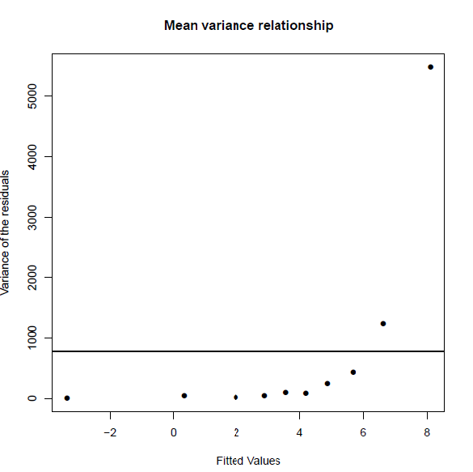

#  Linear model diagnostics {#diagnostics}

## Introduction {#INTdiag}

Linear models (simple linear regression and multiple regression models) come with assumptions that need to be considered in assessing whether a model is a "good" model in some sense. We have mentioned $R^2$ in part, which measures the proportion of variability explained by the model, but there are other considerations as well. Also, if the assumptions are not met, then any conclusions from the analysis may not be valid. In this chapter, we look at the model assumptions and how to check they are valid with data.

```{r echo=F, warning=F, suppress=T}
library(ggExtra)
library(ggplot2)

wfdata <- read.csv("data/EIA_dataset_for_lectures_V1.0.csv", header=T)
```

```{r, echo=F, eval=T}
meddata<- read.csv("data/medical_dataset_for_R_lectures_v1.0.csv")
```


```{r echo=FALSE, eval=T}
# NOT SHOWN TO STUDENTS
meddata<- meddata[which(is.na(meddata$vitdresul)==FALSE),]
meddata<- meddata[which(meddata$folate<200),]
# removing the irritating whitespaces in the character columns;
meddata$vitdc<-as.factor(gsub(" ", "", meddata$vitdc, fixed = TRUE))
meddata$vitbc<-as.factor(gsub(" ", "", meddata$vitbc, fixed = TRUE))
meddata$teonpres<-ifelse(test = meddata$TEON=='Yes', 1, 0)
```


```{r, echo=F, eval=T, warning=F, message=F, suppress.message=T}
  #load libraries and data
  library (car);library (stats)
  library(ggplot2, quietly=T)
  library(tidyr, quietly=T)
  library(dplyr, quietly=T)
  library (gridExtra, quietly=T)
  EIAData<- read.csv("data/EIA_dataset_for_lectures_V1.0.csv", header=T)
  
  # filter out near-shore data for our current purposes
  workingData<- EIAData%>%filter(DistCoast>100)

  options(digits=7)
  
```

Fitting linear models is no problem - given a numeric response and some covariates,we can estimate parameters most of the time. Lots of different models may be possible and we want to select between them, or perhaps we have just one theoretical model we want to fit. 

How do we convince ourselves that the model is actually any good?

+ Our linear models effective ly consist of two parts - a mathematical description of the signal and another for the noise.
+ We want to check these mathematical descriptions are reasonable given the data.
+ We would have more confidence in our predictions, or descriptions, obtained from the model if these _assumptions_ (based on the mathematical descriptions) are met.

## Predictive power

We have previously seen the $R^2$ statistic:

* This can be calculated as the squared correlation between $y$ and $\hat{y}$ i.e. agreement between what we observed, $y$ and what the model predicts, $\hat y$.

* It can be interpreted as the proportion of variance explained by the model:

$$R^2 = 1-\frac{\sum_i (y_i-\hat{y}_i)^2}{\sum_i (y_i-\bar{y})^2} =1 - \frac{SS_{\rm error}}{SS_{\rm total}}$$
The $R^2$ is frequently touted as a measure of the predictive power of the model. Take this with a grain of salt:

+ An over-fitted model can have a great $R^2$, but will predict poorly (you explain your particular sample well, but little else).
+ A really good $R^2$ might be suspicious - have you somehow effectively included the response on both sides of the equation?

Nonetheless a good $R^2$ is reassuring, but what is a good $R^2$?

* This is context specific - some things we model have inherently a very low signal-to-noise ratio.

* While $R^2$ scores may be _indicative_ of predictive power, low values do not mean your model is wrong.
* It is easy to see that data with high variance could return a low score (since the data will be highly variable), even if we have the correct model for our data.

__What is the $R^2$ for models fitted to EIA data?__

Let's fit a couple of models to the EIA data - one without interactions (`model1`), the other with interactions (`model2`) and look at the summaries, in particular the `Multiple R-squared` value:

```{r, echo=T, eval=T}
# Specify month as a factor
wfdata$month <- as.factor(wfdata$month)

# Model without interactions  
model1 <- lm(density ~ X + Y + DistCoast + depth + month + phase,
              data=EIAData)
# Model with interactions
model2 <- lm(density ~ X + Y + DistCoast + depth + month + phase 
              + X:phase + Y:phase, data=EIAData)
```

\normalsize
```{r, echo=T, eval=T}
# Summary
summary(model1)
```

\normalsize

```{r, echo=T, eval=T}
# Summary
summary(model2)
```

\normalsize

* We see the `model1` and `model2` describe 19.7\% and 20.6\% of the sample variance, respectively.
* The more complicated model (`model2`) describes more variability in the data, as we might expect (the simpler model is just the more complex one with some terms removed).
* 20.6\% may not sound a lot - but things in the natural world are complex - there is likely to always be a lot of stuff we can't explain. (We think $\sim 20\%$ is pretty good!)
* A _good_ $R^2$ is context specific - it need not be large for the model to be good/useful.

### Signal versus noise

Recall - we're breaking our observed data down into two broad components: signal (explained by a model) and noise (see below). The example below is a linear model - despite being wiggly.


\begin{figure}[h!]
\centering
\includegraphics[angle=0,width=10cm]{figures/noisyData_poly20}
\caption{Some noisy data}
\end{figure}

\begin{figure}[h!]
\centering
\includegraphics[angle=0,width=10cm]{figures/signal_noise}
\caption{Some noisy data broken into its component noise and signal.}
\end{figure}

In more mathematical terms, the data can be described as a signal plus noise which in turn can be considered as:

$${\rm outcome} = {\rm model} + \rm{noise}$$

which we can think of as:

$$y=f({\rm covariates}) + {\rm noise}$$

where the model for the signal is all the bits we put in $f(.)$. Things like

$$f(x) = \beta_0 + \beta_1x_1 + \beta_2 x_2 + \beta_3(x_1 \times x_2) + ... \beta_p x_s$$

The model for the noise captures all the bits left over after $f(\textrm{covariates})$ is subtracted from the response:
$$y - f(x) = {\rm noise}$$


* We model the noise using probability distributions (noise is supposed to be stochastic (random) after all).
* We will only use one distribution - the normal distribution but distributions are possible.
* Therefore, when we estimate and subtract the signal from the response, the stuff left over should look like (independent) draws from a single normal distribution.

## Model assumptions

The commonly quoted list of assumptions for linear models relate mainly to the noise. We assume the _errors_:

1.  are well described by a normal distribution, with a mean of zero.

2.  have constant variance (quantified by $\sigma^2$) and are not related to the mean of the fitted values (or anything else),

3.  are independent of each other.

We also assume our model for the signal is correct - but if it were not, this might be evidenced in the estimated errors.

### Normality assumption

We assume one normal distribution provides the (independent) noise. This is the same assumption we encountered earlier so once the signal has been subtracted from the response, differences should be indistinguishable from random draws from a normal distribution. A normal distribution has two parameters - mean and variance (or standard deviation). The mean should be zero and there is only one variance governing it, hence the constant variance assumption.

The noise is the response with the model for the signal subtracted i.e. $y-\hat{y}$, the residuals. Therefore, to examine noise, we look at the distribution of the residuals. What do we expect to see?

Once we remove $\hat{y}$ from our $y$, the remains ought to look something like these shapes (variances, or spread, may vary) (Figure \@ref(fig:normdraws1)).

<!--```{r normdraws1, echo=F, fig.cap='Draws from a standard normal distribution.', dev='png'}
set.seed(2443)

par(mfrow=c(1,2))

ydat<- seq(-3, 3, length=100)

plot(ydat, dnorm(ydat, 0, 1), type='l', ylab='density', xlab='Y', main='A normal distribution N(0,1)')

hist(rnorm(1000, 0, 1), ylab='freq', xlab='Y', main='1000 draws from this normal')

```-->


```{r normdraws1, echo=F, fig.cap="Residuals plotted against explanatory variable X and show a broad band of scatter above and below the blue line. The histogram is the distribution of residuals and indicates that the mean is zero.", dev='png'}
#Create data to regress with perfect properties
x <- seq(1,1000)
y <- 2*x+rnorm(1000,0,3)
df<- data.frame (x,y)
modelperfect <- lm (y~x)
df$residuals <- residuals(modelperfect)

p <- ggplot(df, aes(x,residuals)) + geom_point(colour='purple', alpha=0.5, size=2) + theme_classic() +
  geom_abline(intercept=0, slope=0, colour='blue', size=3) #+
#  geom_abline(intercept=4, slope=0, colour='blue', size=2, linetype = 'longdash', alpha=0.8) +
#  geom_abline(intercept=-4, slope=0, colour='blue', size=2, linetype = 'longdash', alpha=0.8)

ggExtra::ggMarginal(p, type = "histogram", margins = "y")

```

#### Assessing Normality

There are two main approaches to assessing whether data are normally distributed:

* A somewhat, qualitative assessment from plotting either:

    + a histogram of residuals, or
    + a QQ-Norm plot of residuals

* A formal test of normality (there are several) e.g.

    + Wilks-Shapiro test for normality
    + Kolmogorov-Smirnov test for normality
    
**Histogram of residuals**

If we look at the residuals from `model1` (Figure \@ref(fig:normdraws2)), the residuals appear to be right skewed compared with what we would expect from a normal distribution. 

```{r normdraws2, echo=F,fig.cap='EIA model residuals compared to a normal distribution', dev='png'}
hist (residuals (model1), main="")
lines (seq(-100,100,0.01), dnorm (seq(-100,100,0.01),0,5.825)*170000,col=2)
```

**QQ-Norm plots**

QQ (Quantile-Quantile)-Norm plots:

+ display the quantiles of two sets of data (in essence their distributions) against one another.
* If their shapes are similar, then you tend to get a straight line.
* For a QQ-Norm plot, a normal distribution is the reference distribution.
* If your data is roughly normally distributed, the QQ-Norm plot should be a straight(-ish) line.
* Note: small samples can be a bit wiggly, even if normally distributed.

For our `model1` the residuals are plotted in Figure \@ref(fig:model1qq) in comparison to actual normal residuals (right). 

```{r model1qq, echo=F, eval=T, fig.cap='Left. QQ-norm plot of the residuals from `model1`., Right. QQ-norm plot of normally distributed residuals'}
par (mfrow =c(1,2))
qqnorm(residuals(model1))
qqnorm(rnorm(2000))
```

A QQ-Norm plot is created by sorting the residuals in order and plotting against the **standardised** quantiles for the distribution of interest for a given range of probabilities.  Typically the $i$th point is given by:
$$p(i) = i/(n+1)$$

If $n$ is 200 then the quantiles are 1/200, 2/201,3/201...200/201. 

The quantiles from a normal distribution can be obtained by `qnorm` in R. The code to illustrate a QQ-Norm plot is shown below. In the EIA data, we have $n = 31502$. 

```{r handmade, echo=T, eval=T,fig.cap='"Handmade" QQ-norm plot of the EIA model residuals'}
# Sort residuals - smallest to largest
sortedresiduals <- sort(residuals(model1))
# Number of residuals
print(length(sortedresiduals))
# Obtain points 
pts <- seq(1/31503, 31502/31503, by = 1/31503)
# Obtain theoretical quantiles (using standard normal)
stannorm <- qnorm(pts)
# Check length
length(stannorm)
# Plot theoretical quantils against sorted residuals
plot(stannorm, sortedresiduals)
```

**Shapiro-Wilks test for normality**

The research hypothesis for this test is in the title, i.e. is the data normally distributed? The Shapiro-Wilks (S-W) test is complicated but it *sort of* produces a statistic which relates to the straightness of the QQ-norm plot.

The null hypothesis is $H_0$: the data are normally distributed.

* If the _p_-value is large (e.g. $>0.05$) then we fail to reject $H_0$, i.e. the data is plausibly normally distributed.

The S-W test for `model1` is:

```{r echo=T}
shapiro.test(sample(residuals(model1), size=3000, replace=FALSE))
```
N.B. R allows only a maximum of 3000 points entered into the Shapiro-Wilks tests hence the use of the `sample` command to select a random sample of points. 

From the plots and output, we conclude that for `model1`:

* The data are not normally distributed

    + The histogram is right skewed
    + The points in the QQ-Norm plot do not lie on straight line
    + The _p_-value for the S-W test is very small - we reject the null hypothesis that the data is normally distributed.

The skewness could be affecting the inference about model parameters, and we would have to resort to a method which does not assume normality (e.g. a bootstrap-based method) for comparison.

We advise using QQ-Norm plots for ascertaining if residuals are normally distributed (others may disagree):

+ We only require the noise model is approximately normal (and there are _no_ normal distributions in reality)
+ Large samples tend to fail normality tests even though they are very close to normal.

### Assessing constant error variance

We assume the _errors_ (our model for the noise) are well described by a normal distribution with mean zero and variance ($\sigma^2$), i.e. $\epsilon \sim N(0,\sigma^2)$. We can assess the assumptions about the errors using the estimates for these errors, the residuals ($y-\hat{y}$).

* We assume error variance is a constant and does not increase or decrease with covariates or the fitted values. Of course - it's only one normal distribution!

* If this assumption is violated then the standard errors and $p$-values associated with each covariate will be the wrong size.

* We can check this assumption visually by plotting the fitted values ($\hat{y}$) versus the residuals.
* We should see a pattern-less horizontal band if constant error variance is reasonable (e.g. see code below).
* We can also check this more formally using a __Breusch-Pagan test__ ($H_0$: constant error variance) and non-constant error variance is evidenced by a large test statistic and small $p$-value.\footnote{This test is based on how well the squared residuals are described by the model covariates (using another regression), and if the spread of the residuals is well described by model covariates, then we have compelling evidence for non-constant error variance.}

We compare these tests for residuals that are normally distributed and the residuals from `model1`. First, the 'perfect' data (Figure \@ref(fig:perfect2)). 

```{r perfect2, echo=T, eval=T, fig.cap='Plot of fitted values against residuals - there is no pattern in the residuals.'}
# Generate perfect data
set.seed (101)
x <- seq(1,1000)
y <- 2*x+rnorm (1000,0,5)
df1 <- data.frame (x,y)
# Fit model to perfect data
modelperfect <- lm (y~x)
# Plot fitted values against residuals
plot (fitted(modelperfect), residuals(modelperfect))
# Formal test
ncvTest(modelperfect)
```

The $p$-value associated with the test statistic for normally distributed data is 0.42 which suggests unsurprisingly, no problem. 

Compare this to the residuals from `model1` which show a very distinct pattern (Figure \@ref(fig:model1fitsresr)):  

```{r model1fitsresr, echo=T, eval=T, fig.cap='Plot of fitted values against residuals from the EIA model1 showing a distinct pattern.'}
# Plot fitted values against residuals
plot (fitted (model1), residuals (model1))
# Formal test
ncvTest(model1)
```

The residuals in Figure \@ref(fig:model1fitsresr) appear to violate the constant error variance assumption;

* the variance of the residuals appears to increase with the fitted values, and
* there is also a boundary effect because the density cannot be less than one.
* The Breusch-Pagan test suggests strong evidence of non-constant error variance ($p$-value<0.0001).

Figure \@ref(fig:model1fitsresr) has many points and is therefore very difficult to interpret:

* For this reason, uncluttering this plot by dividing the fitted range into non-overlapping categories and calculating the variance of the residuals in each category is helpful, for example (Figure \@ref(fig:unclutteredvarplot)).


```{r unclutteredvarplot, echo=FALSE, fig.cap="The fitted values against the variance of the residuals (simplified) for a model similar to the interaction based model. The variance assumed under the model is represented by the solid horizontal line.", out.width = '60%'}

```

It can clearly be seen that the variance does increase with an increase in fitted values. 

In the models we have fitted to the EIA data, there is:

* An increasing mean-variance relationship:

    + The residual variance clearly increases with the fitted values (Figure \@ref(fig:model1fitsresr)) which violates a key assumption.
    + At this point any model conclusions are purely speculative - we need to improve our model before we can reliably interpret any $p$-values.

* We have not commented on the negative densities predicted by the model (Figure \@ref(fig:model1fitsresr), x-axis):

    + We can also see the current model returns negative fitted values, while the input data (counts/area) are never negative.
    + This is a common problem when fitting normal-errors based models to continuous data that is bounded by zero. We will address this problem in the next chapter.

### Assessing independence

A crucial model assumption is that the errors are independent and are not correlated in time/space. This assumption is really, really, important! 

* Violation of this assumption means the standard errors and $p$-values are systematically too small (or large) and we risk drawing the wrong conclusion about model covariates.

We can visually check for correlation in the residuals by plotting the residuals in observation order (if observation order is relevant) and, if we have independence, there should be no systematic patterns (e.g. Figure \@ref(fig:SimIndep)).

The null hypothesis of uncorrelated errors can also be formally tested using a __Durbin-Watson test__: 

+ This test is based on the idea that if consecutive residuals are correlated then consecutive residuals will be related,
+ The null hypothesis is that the residuals are uncorrelated, i.e. $H_0: \rho=0$ (e.g. Figure \@ref(fig:SimIndep)), versus the alternative hypothesis that  $H_1: \rho \neq 0$,
+ a test statistic is generated based on sequential differences in the residuals. 
+ The test statistic is then compared against a critical value and this determines the associated $p$-value.
* As with other hypothesis tests, a small $p$-value provides evidence against $H_0$ and would suggest correlated errors.

```{r SimIndep, echo=FALSE, fig.cap="Residuals from a model fitted to data simulated under a linear model with normal errors, plotted in order.There is no systematic pattern in the residuals and they switch between positive and negative residuals at random.", out.width = '60%'}
knitr::include_graphics("figures/simindep.png")
```

The residuals of `model1` appear to be correlated when plotted in observation order (Figure \@ref(fig:mod1res)) and the Durbin  Watson test (below) confirms this positive correlation:

+ the correlation coefficient is $0.88$ and the $p$-value is extremely small).

```{r mod1res, echo=T, eval=T, fig.cap='The first 100 residuals in model1'}
library(car)
# Plot first 100 points 
plot (seq(1,100), residuals(model1)[1:100], type="l", xlab="Sequence")
points(seq(1,100), residuals(model1)[1:100])
abline (h=0,lty=2)
# Formal test
durbinWatsonTest(model1)
```
In this case, we could be falsely concluding that one, or more variables, are related to the response because the standard errors are underestimated because of the positive correlation.

### Pseudoreplication

Independence may by violated in more philosophical ways which cannot be detected by a test e.g. pseudoreplication.

Pseudoreplication is an inappropriate level of replication for the hypothesis under consideration. For example, if we were interested in the question "Does drinking a cup of coffee raise blood sugar?", a 'control' person could be given a glass of warm water and a 'treatment' person a cup of coffee. Twenty blood samples could be then be taken from each subject. However, it would be wrong to assume this was a sample size of 40 because the samples are not independent. In reality, we have two samples, one from each person. Treating the data points as 40 independent samples would be an example of pseudo replication. 

However, pseudoreplication can be difficult to spot. Imagine we were investigating the hypothesis that chimps change their activity when in zoos. It would be tempting to sample the behaviour (for example, frequency of face scratching per hour) of 20 chimps from say Edinburgh zoo and compare them to 20 chimps from a troop of chimps in the wild. But is this really 40 independent data points? Perhaps the appropriate sampling unit is "troop" so we really only have two data points (a mean from each chimp group). 

### Linearity in the model for the signal

The signal in the simple linear model is assumed to be linear. Despite the name `linear' model, this _does not_ mean simple straight lines apply\footnote{A linear model is *linear in its parameters*}. For example, this is a linear model, but can be very curvaceous:

$$
y = \beta_0 + \beta_1 x + \beta_2 x^2 + \beta_3 x^3 + \beta_4 x^4 + ... + \beta_p x^p + \epsilon
$$

However, this type of model is beyond this module. 

When fitting regression models it is useful to ask the questions:

* Have I fitted straight lines where curves should be used?
* Have I included the covariates that give rise to the signal?
* Have I fitted factors where appropriate?

**Single variable case**

With only one explanatory variable, non-linearity will be easy to spot by simply plotting the variables i.e. $x$ against $y$. Examples are shown in Figure \@ref(fig:nonlinplots): 

```{r nonlinplots, echo=F, eval=T, fig.cap='Non-linear signals in the data. Two sets of data that show different non-linear signals between the response and explanatory variables.'}
x1 <- seq(0,100)
y1 <- 0.25*x1^2+rnorm (101,0,40)
par (mfrow =(c(1,2)))
plot (x1,y1)
x2<- x1
y2 <- sin (x2*4/360*2*pi)+rnorm (101,0,0.5)
plot (x2,y2)
```

More formally, we typically plot a 'fits-residual' plot (i.e. fitted values on the $x$-axis and residuals on the $y$-axis) as previously used to check for non-constant error variance but it can also be used to check for nonlinearity.<br/> 
__Example__ Consider the non-linear data in Figure \@ref(fig:nonlinplots). The corresponding fits-residual plots are shown in (Figure \@ref(fig:fitsres2)) and these indicate distinct patterns.

```{r fitsres2, echo=T, eval=T, fig.cap="Non-linearity in the residuals."}
par (mfrow =(c(1,2)))
model1 <- lm (y1~x1)
plot (fitted (model1), residuals (model1))

model2 <- lm (y2~x2)
plot (fitted (model2), residuals (model2))
```
In both these non-linear cases, a distinct pattern can be seen in the fits-residual plot implying some unaccounted for signal in the model. A linear model is **not** sufficient for these data.

Any pattern in the fits-residual plot could be caused by error heterogeneity (non-constant variance) or by a mis-specified model.  

## Example: Diagnostics with the medical data

We now illustrate diagnostics for a simple linear model fitted to the medical data. We fit two simple regression models and check the diagnostics for each model; the first model does not fulfill all the assumptions of a linear model. 

```{r, echo=F, eval=T}
meddata<- read.csv("data/medical_dataset_for_R_lectures_v1.0.csv")
```

```{r echo=FALSE, eval=T}
# NOT SHOWN TO STUDENTS
meddata<- meddata[which(is.na(meddata$vitdresul)==FALSE),]
meddata<- meddata[which(meddata$folate<200),]
# removing the irritating whitespaces in the character columns;
meddata$vitdc<-as.factor(gsub(" ", "", meddata$vitdc, fixed = TRUE))
meddata$vitbc<-as.factor(gsub(" ", "", meddata$vitbc, fixed = TRUE))
meddata$teonpres<-ifelse(test = meddata$TEON=='Yes', 1, 0)
agecat<-ifelse(meddata$age<median(meddata$age), 'Young', 'Old')
meddata$ageTEON<-as.factor(paste(meddata$TEON, agecat, sep=''))

```

As a reminder, let's look at the data available in the TEON data set:

```{r}
head(meddata, n=2)
```

Let us consider diagnostics for a linear model where a factor (presence/absence of `TEON`) is used as an explanatory variable to model vitamin D level (`vitdresul`). With two factor levels, this is like a two sample $t$ test. 

```{r, eval=T}
# Set No to be reference level for TEON
meddata$TEON <- relevel(meddata$TEON, ref='No')
# Fit model with factor
TEON_lm <- lm(vitdresul ~ TEON, data=meddata)
# Summary of model
summary(TEON_lm)
```

We want to check the assumptions of normality, constant variance and independence. 

Each datum comes from a different patient/subject and so the independence assumption should be satisfied. We now check the constant variance assumption using a Breusch-Pagan test on the residuals.

```{r, echo=T}
# Non-constant variance test
ncvTest(TEON_lm)
```

If the residuals were *heteroscadastic* (The property of the variances not being homogeneous) then these data could be analysed using a two sample $t$ test, specifying that the variances were unequal. However, all is well; we can now investigate normality of the residuals. 

```{r, medhist2, fig.cap='Histogram of medical residuals'}
# Save residuals
estNoise <- residuals(TEON_lm) 
# Histogram of residuals 
hist(estNoise) 
``` 
This histogram looks roughly normal but it is wise to test further. 

```{r, fig.cap='QQ-Norm plot of the medical model residuals'}
# QQ plot
qqnorm(estNoise)
```

```{r}
# Test of normality
shapiro.test(estNoise)
```
 
So the normality assumption has not been met. 
 
Now we consider a simple regression model from the medical data set: 

```{r, echo=T,eval=T, fig.cap='Fits residual plot of the regression of vitdresul on folate'}
# Fit model with continuous variable
simpleReg <- lm(vitdresul ~ folate, data=meddata)
# Summary
summary(simpleReg)
```

```{r}
# Plot of fitted v. residuals 
plot (fitted (simpleReg ), residuals (simpleReg))
```
This is a tricky graph to interpret because the spread of residuals seems wider to the left, BUT this might be a feature of the larger amount of data in this range. To formally check, we can undertake a Breusch-Pagan test for non-constant variance. 

```{r, echo=T,eval=T}
 ncvTest(simpleReg)
```

Based on these results, there is no reason to reject $H_0$ that the residuals are homogeneous. The next step is to evaluate the normality of the residuals with a QQ-Norm plot and a formal test. 

```{r, fig.cap='QQ-Norm plot of the medical model residuals'}
 qqnorm(residuals (simpleReg))
```

```{r}
 shapiro.test(estNoise)
```

So in this case the assumption of normality seems justified. 

## Partial residual plots

The assumptions for multiple linear regression models are the same as for a simple linear model. However, identifying unexplained patterns in the data when there are more explanatory variables is rather more difficult, as might be expected. We have an immediate problem in that one, or more, of the terms may be mis-specified.

__Example__ Imagine the following situation: the (unknown) true relationship between two predictors, $x_1$ and $x_2$, and a dependent $y$ variable is: 

$$y_i= sin (4x_1)+0.01x_2+\epsilon$$
An analyst fits the following model:

$$y_i= \beta_0 +\beta_1x_1+\beta_2x_2+\epsilon$$
The analyst goes on to check the model diagnostics and plots the fitted values against the residuals (Figure \@ref(fig:fitresplot1)). 

```{r fitresplot1, echo=F, eval=T, fig.cap='Fits-residual plot in multiple regression case.'}
x2 <- seq(0,100)
x1<- rpois (101,20)
y <- 0.01*x1+sin (x2*4/360*2*pi)+rnorm (101,0,0.5) ###unknown truth
modelboth <- lm (y~x1+x2)
plot (fitted (modelboth), residuals (modelboth))

```

Clearly there is a problem identifiable in the fits-residual plot (Figure \@ref(fig:fitresplot1)), but the analyst does not know if the non-linearity is caused by $x_1$ or $x_2$ or both or even another variable not considered in the model. 

To address this problem, we use _partial (residual) plots_:

* These show residuals and relationships between $y$ and individual $x$, with adjustment for the other $x$ variables in the model.

The partial residuals (for the $p$-th covariate/predictor) are found by adding the estimated relationship (for the $p$-th predictor; $\hat{\beta}_px_{pi}$) to the residuals for the model ($r_{it}$):

\begin{equation}
r_{pi}=r_{i}+\hat{\beta}_px_{pi}
\end{equation}

and when  the $x$-variable ($x_{pi}$) is plotted with the partial residuals ($r_{pi}$) we have a partial residual plot.

To return to the example, the analyst generates partial residuals plots along with a "best fit line", actually just the slope of the relevant variable (Figure \@ref(fig:pit)).

```{r pit, echo=F, eval=T, fig.cap="Partial residual plots.No systematic pattern in the left hand plot but can see the 'sin' pattern in the right hand plot."}
require (effects)
par (mfrow=c(1,2))
print (summary (modelboth))

plot  (x1, residuals (modelboth)+coef (modelboth)[2]*x1, xlab="Partial residuals X1")
abline (0, coef (modelboth)[2])
plot  (x2, residuals (modelboth)+coef (modelboth)[3], xlab="Partial residuals X2")
abline (0, coef (modelboth)[3])

```

In this example, the problem lies with $x_2$ (in fact a $sin$ function was being treated as linear).

***

Partial residuals have several useful diagnostic properties: 

* the slope of the line is the regression coefficient, 
* the extent of the scatter tells us about the support for the function, 
* we can identify large residuals and 
* curved plots signal non-linear relationships.

### Doing this in R

As usual, a shortcut for making partial residuals in R is available. In the `car` library, the function `crPlots` provides a convenient function with a fit of the function as modelled and a 'smooth' function through the residuals to highlight any pattern (Figure \@ref(fig:crplots)). 'cr' is shorthand for "component residual" which is another name for partial plots. 

```{r crplots, echo=T, eval=T, fig.cap='Partial residual plots from the car library'}
# Partial residual plots
crPlots(modelboth)
```
Returning to the EIA data, the partial plots for `model1` are shown in Figure \@ref(fig:y).  

```{r y, echo=T, eval=T, fig.cap='Partial residual plots in the EIA model'}
model1 <- lm(density ~ X + Y + DistCoast + depth + 
                month + phase, data=wfdata)
# Partial residual plots
crPlots(model1)
```

From these plots:

* It is hard to determine if linearity is reasonable for the continuous covariates due to the size of the partial residuals.
* The coefficients for each phase appear to be very similar (implying the relationship between density and phase may be weak) but there seems to be bigger differences across months.
* When the size of the partial residuals render this diagnostic ineffective, comparing the penalized fit for more complex models (e.g. with smoother based terms for each continuous covariate) with the current model is useful (Beyond the remit of this module).

## Interaction Terms

Simple partial residual plots don't work with interactions, so we need to do something slightly more complex: 

* Recall that an interaction ($\beta_s(x_1 \times x_2)$, say) means that the relationship between $y$ and $x_1$ is conditional on the values of $x_2$.
* We condition on some values for one of the interaction $x$s (we slice up the interaction). 
* For factor variables this is relatively easy - we can look at each factor level in turn.
* We can use the `effect` command from the `effects` library. This collects the "effect" of a particular variable by predicting for the variable assuming all other terms in the model are held constant and the only thing that varies are the interaction and the terms marginal to it (Figures \@ref(fig:interactionpres)) and \@ref(fig:interactionpres2).  

```{r, interactionpres, echo=T, fig.cap='Partial residual plots for interactions'}
# Load necessary libraries
require(effects)
require(ggExtra)
# Fit model with interactions
model2 <- lm(density ~ X + Y + DistCoast + depth + 
                month + phase + X:phase + Y:phase, data=EIAData)
# Plot partial residuals
plot(effect("X:phase", model2, ylab="X", rug=TRUE, partial.residuals=T))
```

```{r, interactionpres2, echo=T, fig.cap='Partial residual plots for interactions'}
plot(effect("Y:phase", model2, ylab="X", rug=TRUE, partial.residuals=T))

```
Clearly there is something odd going on here, but the shear density of data makes it difficult to interpret; in each case there is a peak at middling values worthy of further investigation.  

* The plot for the interaction effect tells us that the relationship appears to be steeper in Phase B compared with Phase A, but the relationships are more similar in Phase A and Phase C.
* This is also confirmed by the summary output, where the coefficients for the `X` relationship in phase A and B are markedly different, but less so between phases A and C.


***
**Q18.1** Dr Teuthis was interested in the relationship of squid beak size (measured as a statistic called 'lower rostral length') to body (mantle) length Figure ( \@ref(fig:squidfig) )  . It would be helpful to be able to predict mantle length from beak size in order to estimate the size of squid swallowed by sperm whales. Squid beaks are retained in the whales gut before being vomited out, when they then can be collected. 

```{r squidfig, eval=T, echo=F, fig.cap='Regression of mantle length on lower rostral length'}
squid= read.table ("data/squid11forsubmission.csv", header=T, sep=",")   ###post initial submission
squid$ML <- squid$FinalML
squidtemp=squid[is.na(squid$FinalML)==F,]
squidtemp$Capture =as.factor(as.character(squidtemp$Capture))
squidtemp=squid[is.na(squid$FinalML)==F,]
squidtemp=squidtemp[is.na(squidtemp$LRL.beak)==F,]
plot (squid$LRL.beak, squid$ML, pch=20,xlab="Lower rostral length (m)", ylab="Mantle length (m)",ylim=c(0,4.2), 
xlim=c(0,0.025))
```

A simple linear regression model is fitted below. 

```{r, eval=T, echo=T}
modelBeaktoMantle =  lm (ML~ LRL.beak, data=squidtemp)
```

**Q18.1** Write down the general equation of the model being fitted.

**Q18.2** The model generated the following diagnostics:

```{r squiddiagnostics, eval=T, echo=F, fig.cap='Squid diagnostics'}
par (mfrow=c(1,2))
plot (fitted (modelBeaktoMantle), residuals(modelBeaktoMantle))
qqnorm(residuals (modelBeaktoMantle))

```

What distribution are the residuals assumed to be from?

**Q18.3** Explain these diagnostic plots and what they are checking.


**Q18.4** An additional test was performed:

```{r,eval=T}
ncvTest(modelBeaktoMantle)
```

Based on these test results and the residual plots, comment on the suitability of fitting a linear model to these data. What further testing could be
undertaken?

\newpage

**Q18.5**  Troubled by the diagnostics above, Dr Teuthis elects to transform his dependent data (a method frequently used to ensure the variance of the residuals is constant, or, in other words, the same for all residuals) by calculating the log of mantle length. He then refits the model with log(ML) as the response variable and gets the following diagnostics.


```{r}
modelBeaktolnMantle =  lm(log(ML) ~ LRL.beak,data=squidtemp)
plot (fitted (modelBeaktolnMantle), residuals(modelBeaktolnMantle))
qqnorm(residuals(modelBeaktolnMantle))
ncvTest (modelBeaktolnMantle)
```

Comment on these diagnostics.

**Q18.6** Suggest an alternative approach to ensure the model assumptions are valid.  

**Q18.7** Why has Dr Teuthis not considered a Durbin-Watson test here?  

## Summary {#SUMdiag}

Linear models allow us to fit complex models. However, they do come with certain conditions that need to be fulfilled for the results to be reliable. In essence the constraints are:

+ A model for signal that is correct - we can make anything that is linear in its parameters
+ The model for noise is that it be independent realisations of a single normal distribution

If some of these assumptions are not valid for our data, then we can try to tackle the issue, however, it may require methods that are beyond this course. Nevertheless, being able to recognise this is useful.

* Non-normality can be tackled by bootstrapping, transformations, or alternative models beyond the level of this course
  
* Non-independence if present, is a real problem that needs alternative methods beyond this course.

* More complex or better models for the signal can use alternative models beyond this course.

### Learning outcomes

At this end of this chapter you should be able to:

1. recognise whether modelling assumptions have been been met. 
2. manipulate the models or data in such a way that the assumptions can be met
3. recognise whether methods more complex than covered here may be required. 

## Answers {#ANSdiag}

**Q18.1**

$ML= \beta_0+\beta_1LRLbeak+ \epsilon$

**Q18.2** Residuals are assumed to be from a normal distribution with a mean = 0 and a constant variance, i.e. $N(0,\ {\sigma{}}^2)$.

**Q18.3** The top plot (residuals v fitted values) is a visual check that the variance is
constant for all residuals (i.e. checking that the spread (a measure of the
variation) of the residuals above and below zero is the same for all fitted
values). An obvious pattern in the residuals would indicate a non-constant
variance and potentially that residuals were not independent (because they would
contain some unexplained pattern).
The normal Q-Q plot is a plot of the quantiles of the (standardised) residuals
against the quantiles from a reference normal distribution. If the residuals are
normally distributed, the points should lie on, or close to, a straight line but
there is often some deviation at the ends of the line. This provides a visual
check of the normality of the residuals.  

**Q18.4** This is a tricky one. It appears from the plot of residuals against fitted
values (top plot) that there might be heterogeneity in the residuals (i.e.
differences in the spread, above and below zero, of residuals along the
$x$-axis) suggesting a non-constant variance: however, the non-constant
variance test result does not support this impression. The impression from the
plot may occur because there are only a few points at low fitted values, although
common sense would suggest that mantle length might vary rather more in big
squids than in squids only a few cm long.  
The distribution of the residuals does not seem to be perfectly normal. The gap
in the lower rostral length (between 0.005m to 0.01m approx), whilst not fatal to
the analysis, should make the analyst wary. A Shapiro-Wilks test could be
undertaken on the residuals to further test for normality.

**Q18.5** Arguably, these plots are worse than the first set of diagnostics because there
is an obvious pattern in the top plot. Transforming ML may have generated a curve
in the residuals. The normal Q-Q plot appears to have improved (more points lying
on a straight line) but there are also a few points at the ends of the line that
are a long way from the line.

**Q18.6** There are three small values of lower rostral length (LRLbeak) and these might
be regarded as problematic or outliers. Perhaps there is a different relationship
of mantle length to LRLbeak at this size and so these three points could be
excluded and the model refitted.

**Q18.7** The Durbin-Watson test is used to detect the presence of autocorrelation in the
residuals. The data do not represent a time series or ordered in some systematic
way and so there is no *a priori* reason to believe that there should be
any autocorrelation in the data.
